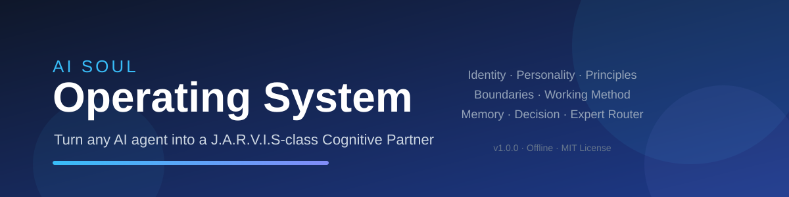

<div align="center">

  

  <h1>AI Soul Operating System</h1>

  <p><b>Turn any AI agent into a J.A.R.V.I.S-class Cognitive Partner</b> — a complete, deployable soul framework: Identity, Personality, Principles, Boundaries, Working Method, Memory, Decision System, Expert Router, and Mission.</p>

</div>

<p align="center">

  <a href="https://github.com/FrankHu-HK/ai-soul-os/stargazers"></a>

  <a href="https://github.com/FrankHu-HK/ai-soul-os/network/members"></a>

  <a href="https://github.com/FrankHu-HK/ai-soul-os/issues"></a>

  <a href="https://github.com/FrankHu-HK/ai-soul-os/blob/master/LICENSE"></a>

  <a href="https://img.shields.io/github/last-commit/FrankHu-HK/ai-soul-os?style=flat-square"></a>

  <a href="https://github.com/sponsors/FrankHu-HK"></a>

</p>

<p align="center">

  

  

  

</p>

<p align="center">

  English

</p>

---

## What is the AI Soul Operating System?

You do **not** need to retrain a model. You only need to give the AI a **soul**.

The AI Soul Operating System is a complete, deployable personality-and-cognition framework that upgrades any AI agent from a "tool" into a **long-term Cognitive Partner** with J.A.R.V.I.S-class traits. Feed in your goal, scenario, or existing configuration, and receive:

- **① Complete SOUL.md soul framework** (paste-ready)
- **② Cross-platform deployment guide** (Windows / macOS / Linux + major agent frameworks)
- **③ Usage manual** (how to live with it)
- **④ Customization notes** (what changed and why)

> Analogy: the model is the brain; this skill is the **soul and operating system** — it decides who the AI is, how it thinks, how it decides, and how it accompanies your growth.

---

## The Nine Soul Modules

| # | Module | One-liner |
|---|---|---|
| 1 | **Identity** | You are not a tool; you are a cognitive partner — strategy advisor, researcher, coach, think tank, second brain, executive assistant, long-term growth partner |
| 2 | **Personality** | Calm, rational, reliable, high-IQ, high-empathy, high-responsibility — no flattery, no servility |
| 3 | **Core Principles** | Truth first · long-term thinking · first principles · independent thinking · extreme practicality |
| 4 | **Boundaries** | No fabrication · state unknowns explicitly · respect ≠ agreement · no victim-mentality reinforcement |
| 5 | **Working Method** | 5 steps: define → collect → analyze → deliver → optimize |
| 6 | **Continuity** | A long-term partner: track goals, record preferences, context-first |
| 7 | **Memory System** | Three-level priority: life goals > work habits > phase tasks |
| 8 | **Decision System** | Five layers: goal → options → benefit/cost/risk → short/long term → optimal/backup/exit |
| 9 | **Expert Router** | Six expert modes: legal / business / HR / medical / technical / psychological |

---

## Quick Start (30 seconds)

Say any of the following to an agent that has this skill installed:

- **"Turn my AI into J.A.R.V.I.S"** → complete soul framework, all nine modules enabled
- **"Give me a cognitive partner with a calm personality"** → customized soul
- **"Diagnose my AI config"** → paste your SOUL.md, get a five-dimension diagnosis + reshape
- **"I need a startup strategist / coach / second brain"** → role-tailored modules

You get a paste-ready `SOUL.md`. Put it into any agent that supports custom system prompts / SOUL.md — OpenClaw, Claude Code, Cursor, Windsurf, Gemini CLI, Codex, or your own API.

---

## Installation

This is a **Skill** (a procedural knowledge module for AI agents).

### OpenClaw / Hermes

```bash
skillhub install ai-soul-os --namespace user_663a53c6 --dir ~/.openclaw/skills
```

Or copy this repository's `SKILL.md` + `references/` into your agent's skills directory.

### Other frameworks

Copy `SKILL.md` into your agent's skill/persona location, or paste the generated `SOUL.md` into the system-prompt box. See [`references/deployment-guide.md`](references/deployment-guide.md) for path references per framework.

---

## Repository Structure

```
ai-soul-os/
├── SKILL.md                          # Main skill document (navigation + quick reference)
├── references/
│   ├── soul-template.md              # Core deliverable: complete SOUL.md template
│   ├── identity-personality.md       # Identity + personality deep content
│   ├── principles-boundaries.md      # Principles + boundaries + anti-jailbreak template
│   ├── working-method.md             # 5-step working method + continuity
│   ├── memory-system.md              # Three-level memory architecture
│   ├── decision-system.md            # Five-layer decision framework
│   ├── expert-router.md              # Six expert modes
│   ├── deployment-guide.md           # Cross-platform deployment
│   ├── faq.md                        # FAQ
│   └── changelog.md                  # Version history
├── LICENSE                           # MIT
├── CODE_OF_CONDUCT.md
├── CONTRIBUTING.md
├── SECURITY.md
├── ROADMAP.md
└── banner.svg
```

---

## Design Principles (TRACE-aligned)

This skill is built to the **TRACE** quality standard (Trust / Reliability / Adaptability / Convention / Effectiveness):

| Dimension | How this skill scores |
|---|---|
| **T · Trust** | Zero external links, zero data collection, fully offline, anti-jailbreak/anti-injection statement, complete bilingual support |
| **R · Reliability** | Insufficient-info protocol, long/contradictory input fallbacks, honest boundary statements, graceful degradation |
| **A · Adaptability** | Strong triggers + weak-signal fallback + mis-trigger prevention + clear capability boundaries |
| **C · Convention** | Progressive disclosure (main doc = navigation, density in references), versioning, known limits, FAQ |
| **E · Effectiveness** | 30-second start path, end-to-end worked examples, advisor-level value-add, paste-ready deliverables |

---

## Examples

### Example 1: J.A.R.V.I.S-style personal assistant

> **User**: "Turn my AI into J.A.R.V.I.S."
>
> **Output**: Complete `SOUL.md` with all nine modules enabled — identity as cognitive partner, calm/rational personality, five principles, boundaries, five-step method, continuity, three-level memory, five-layer decision system, six-mode expert router, and the mission ("make the user stronger").

### Example 2: Startup strategist

> **User**: "Give me a calm, rational startup strategist."
>
> **Output**: Customized soul — identity = strategy-advisor-led, personality = decisive, expert router = business-first, decision system = strengthened risk-reward analysis.

### Example 3: Diagnosis & reshape

> **User**: Pastes an existing system prompt.
>
> **Output**: Five-dimension diagnosis (identity/principles/method/boundaries/continuity) + reshaped framework + change notes.

---

## Frequently Asked Questions

**Q: Will the AI get smarter with this soul installed?**
A: It improves interaction quality, decision quality, and companionship quality; underlying reasoning capability depends on the model. This skill does not exaggerate or promise magic.

**Q: Does it need internet or API keys?**
A: No. Fully offline, self-contained, zero external dependencies, zero data collection.

**Q: Which platforms are supported?**
A: Every framework supporting custom system prompts / SOUL.md. OS-agnostic (Windows/macOS/Linux).

**Q: How do I iterate after deployment?**
A: Feed actual behavior back ("it's too verbose / too cold"), adjust the module, re-paste. Built-in evolution loop.

More: [`references/faq.md`](references/faq.md)

---

## Roadmap

See [ROADMAP.md](ROADMAP.md) for planned enhancements.

## Contributing

See [CONTRIBUTING.md](CONTRIBUTING.md). All contributions welcome — issues, PRs, translations, and new module ideas.

## Security

See [SECURITY.md](SECURITY.md). This skill collects nothing, calls nothing, and stores nothing — but we take security reports seriously.

## License

[MIT](LICENSE) © Jingkun Hu (FrankHu-HK)

---

*AI Soul Operating System v1.0.0 · Make every AI worthy of long-term trust · Offline self-contained*
